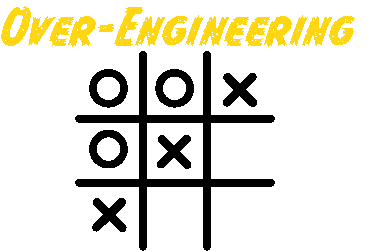

Over-Engineering Tic-Tac-Toe CLI
---

A CLI for running Tic-Tac-Toe - from the project [Over-Engineering Tic-Tac-Toe](https://github.com/briancorbinxyz/overengineering-tictactoe) built using modern Java Frameworks: Quarkus/PicoCLI/GraalVM for development speed and native execution.

## Running the application

### Help
```bash
tictactoe-cli --help

Usage: tictactoe [-hsV] [-d=<dimension>]
A Game of TicTacToe
  -d, --dimension=<dimension>
                  The dimension of the game board (default: 3, for a 3x3 board).
  -h, --help      Show this help message and exit.
  -s, --serialization-enabled
                  Serialized persistence enabled (default: false).
  -V, --version   Print version information and exit.
```

### Playing
```bash
# Will currently simply run the game with a bot player 'X' facing another bot player 'O'.

tictactoe-cli
```

#### Example Output
```bash
Players: X, O ([Local{playerMarker=X, player=BotPlayer[strategyFunction=org.xxdc.oss.example.bot.BotStrategy$$Lambda/0x000001fe013d3c68@4e7afe5a]}, Local{playerMarker=O, player=BotPlayer[strategyFunction=org.xxdc.oss.example.bot.BotStrategy$$Lambda/0x000001fe013d3c68@4e7afe5a]}])- TicTacToeClient/1.0 [Local (X:BotPlayer)] (IP: 127.0.0.1; Host: corbinm1mac.local; Java: 23; OS: Mac OS X 14.6.1)                             - TicTacToeClient/1.0 [Local (O:BotPlayer)] (IP: 127.0.0.1; Host: corbinm1mac.local; Java: 23; OS: Mac OS X 14.6.1)
___
___
___

__X
___
___


_OX
___
___


_OX
X__
___


_OX
X_O
___


XOX
X_O
___


XOX
X_O
_O_


XOX
XXO
_O_


XOX
XXO
_OO

Winner: Player X!
XOX
XXO
XOO
```

## Developing, packaging, deploying and running the application

See: [Tic-Tac-Toe CLI - README.MD](tictactoe-cli/README.MD)
